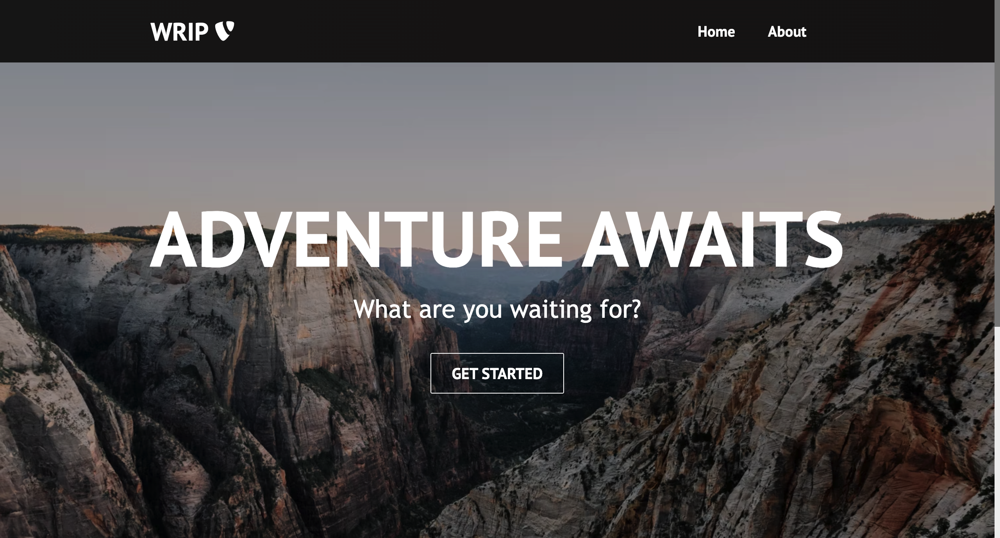

# WRIP
WRIP is short for Weather Road Trip and is a React based Website with a Google Maps API that shows you specific places on a Map with the corresponding weather Information. This project was created as part of a University course and is not in a bug free state.
There is a live version wich might shut down one day. The Link is under the About section.

